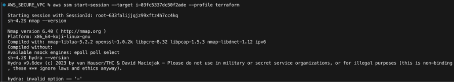
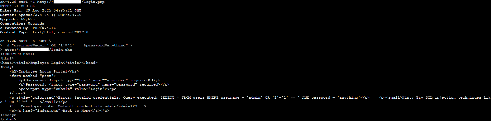
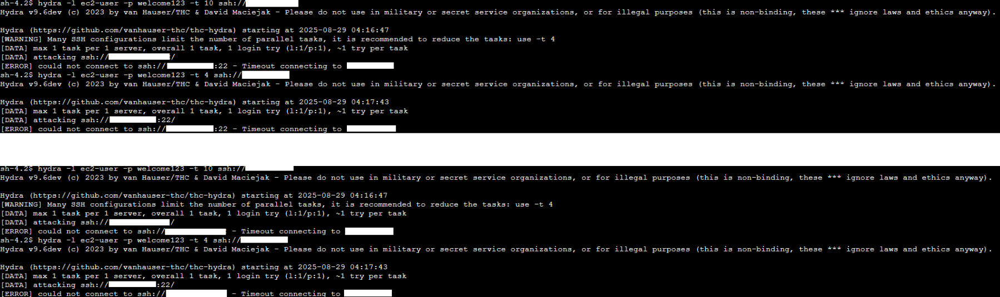
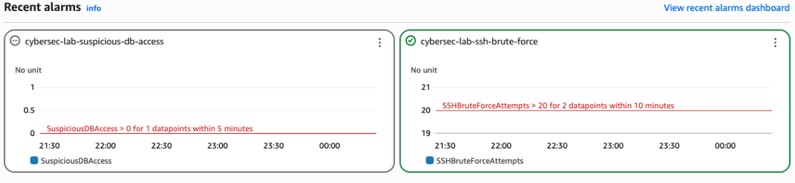
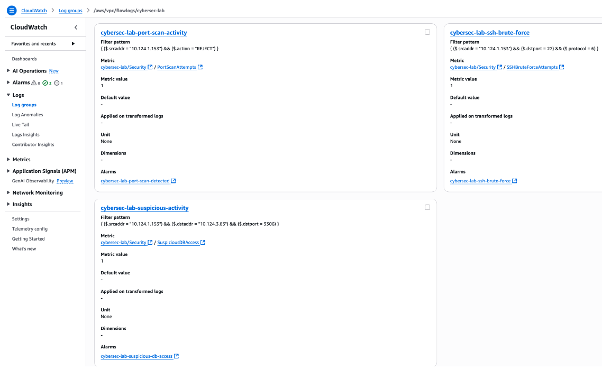
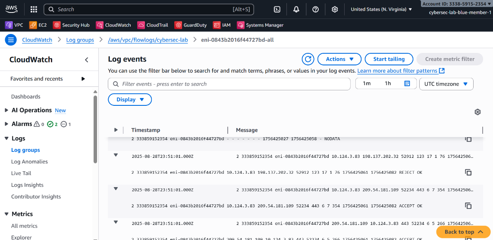

# AWS Attack and Defense Range Lab
### Cloud-Native Purple Team Simulation

**Project Status:** Complete | **Classification:** Cloud Security / Incident Response / Infrastructure as Code (IaC)

## 🎯 Project Goal

The purpose of this project was to simulate a cloud-native cyber range on **AWS** that could replicate real-world attack and defense scenarios within a secure, isolated environment. This lab was designed to emphasize **isolation, realism, automation, and integrated defense**.

The primary objectives were to:
1. Build secure and automated infrastructure using **Terraform** (IaC).
2. Conduct offensive operations (simulated compromise) and defensive monitoring in a controlled environment.
3. Map all activities to the **MITRE ATT&CK®** framework to demonstrate visibility and detection capabilities.

## 📁 Technical Documentation

The comprehensive report, detailed infrastructure-as-code files, and full findings for this project are available below.

**[➡️ Download Full Project Report (PDF)](documentation/AWS_Attack_and_Defense_Range.pdf)**

## 💡 Skills Demonstrated

* **Cloud Infrastructure:** Building and managing core AWS networking components (VPC, Subnets, Internet Gateways).
* **Infrastructure as Code (IaC):** Using **Terraform** to deploy, manage and tear down the entire cloud environment safely and repeatably.
* **Offensive Operations:** Deploying a **Ubuntu Server** EC2 instance to execute reconnaissance and exploitation (Hydra, SQLi).
* **Cloud Incident Response:** Configuring and analyzing alerts from **CloudWatch Alarms** and forensic data from **VPC Flow Logs**.
* **Security Architecture:** Implementing security best practices using **Security Groups** and **Network Access Control Lists (NACLs)**.
* **Security Frameworks:** Mapping offensive and defensive actions to the **MITRE ATT&CK®** framework.

## 🛠️ Tools & Technologies Used

* **Cloud Platform:** Amazon Web Services (AWS)
* **Infrastructure as Code:** Terraform
* **Networking/Security:** AWS VPC, Security Groups, NACLs
* **Monitoring/Defense:** CloudWatch Alarms, VPC Flow Logs, CloudTrail
* **Offensive Tooling:** Ubuntu EC2 Instance, Hydra, cURL
* **Frameworks:** MITRE ATT&CK®

---

## ⚙️ Methodology & Architecture

### Network Architecture: Isolated AWS VPC

The environment utilized a secure, multi-tiered VPC with public and private subnets, ensuring the target resources were shielded from direct internet exposure.

* **Public Subnet:** Hosted the NAT Gateway, Bastion Host, and the Kali Attacker EC2 instance.
* **Private Subnet:** Hosted the vulnerable web server target EC2 instance, shielding it from the public internet.

## 📸 Validation and Proof of Concept

This section visually confirms the infrastructure setup (IaC), the simulated attack (Red Team Kill Chain), and the subsequent detection and analysis (Blue Team).

### 1. Infrastructure as Code (IaC) Deployment

* **IaC Reference:** The Terraform configuration files for this VPC and resource deployment are available in the group repository: [https://github.com/tadiusfrank2001/AWS_SECURE_VPC](https://github.com/tadiusfrank2001/AWS_SECURE_VPC)
* **Evidence: Terraform Apply Success (IaC):** The final output confirming the successful creation of all network and compute resources (VPC, Subnets, EC2 instances) via Terraform.

  .png)

### 2. Offensive Operations: Simulated Compromise (Exploitation Focus)

* **Evidence: Ubuntu EC2: Version Check:** Initial check on the application version for Nmap and Hydra.
    
* **Evidence: Ubuntu EC2: SQL Injection via cURL:** Terminal output showing the execution of a SQL injection payload using the `curl` command, confirming a successful application layer exploitation against the target.
    
* **Evidence: Kali EC2: Hydra Brute-Force Attack:** Terminal output confirming the brute-force password attack was successfully launched from the Ubuntu EC2 instance against a service on the target.
    

### 3. Defensive Operations: Detection and Log Analysis

* **Evidence: CloudWatch Alarms: DB Access & Brute-Force:** Screenshot showing the CloudWatch Alarms console, which triggered alerts for high-priority events like suspicious database access and SSH brute-force attempts.
    
* **Evidence: CloudWatch Log Groups Analysis:** Screenshot of the CloudWatch Log Groups console, confirming that VPC Flow Logs and other logs were being aggregated and ready for forensic analysis.
    
* **Evidence: CloudWatch Log Events:** Detailed view of a log event, showing the forensic data (source/destination IP, ports, action) collected during the attack, allowing for post-incident reconstruction.
    

---

## 🧠 Lessons Learned & Next Steps (Reflection)

### Lessons Learned
* The project reinforced the value of **Infrastructure as Code (IaC)**, proving that complex environments can be provisioned and destroyed safely and cost-effectively.
* Learning to configure **CloudWatch Alarms** and analyze high-volume data from **VPC Flow Logs** was critical to understanding the attack timeline and implementing automated defense.
* Building a secure environment required careful configuration of **Security Groups** and **NACLs** to segment the network correctly.
* Understanding budgeting and keeping EC2 instance within free tier utilization.

### Next Steps
* Integrate a **serverless response function** (e.g., AWS Lambda) to automatically isolate a compromised EC2 instance upon receiving a high-severity CloudWatch/GuardDuty finding.
* Expand the range to include **EKS (Kubernetes)** or **S3 misconfiguration** scenarios.

---

## 🔒 Ethical & Security Compliance

This project is for **educational and portfolio purposes only**. All infrastructure was deployed in a dedicated AWS account and destroyed immediately upon project completion. **No real credentials or confidential information were used.** All offensive activity was contained within the self-constructed, isolated AWS VPC.
